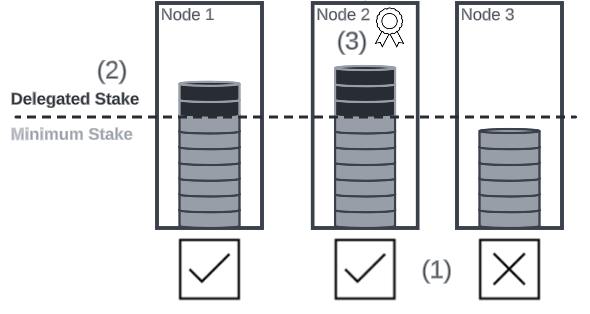
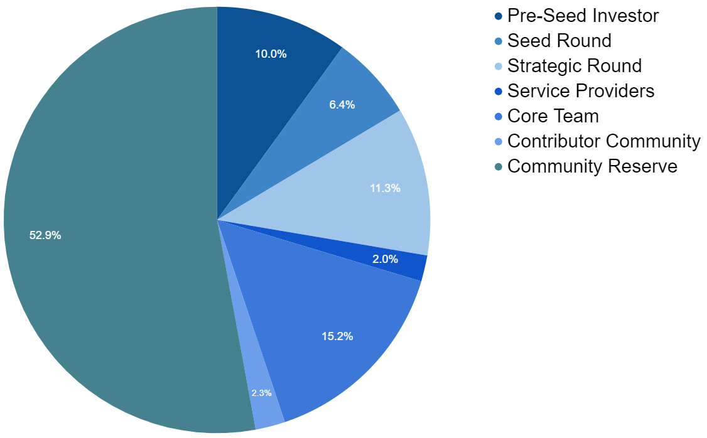
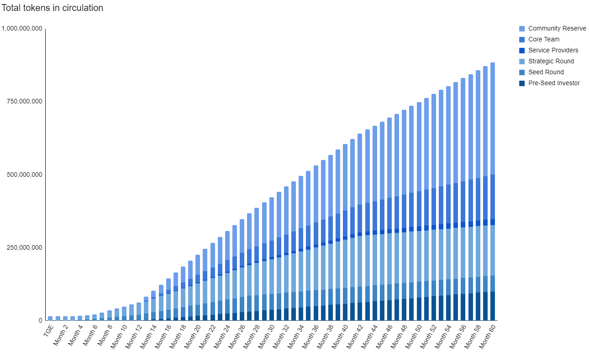

# Token Utility Whitepaper - v2.6

## Introduction 
A token economy is non-trivial and continues to be an area of much research and debate in the Web3 community. This proposal document is just that, a proposal which is intended to deliver a viable starting point for a Ten token economy. The economic model is expected to evolve over the lifetime of Ten via governance proposals.

The eventual Ten implementation depends upon a network of intercommunicating Ten nodes to achieve its decentralisation, scalability and confidentiality promises. Ten node operators incur operating costs for which they need to be remunerated. This is achieved through a rewards and incentives model. Ten's native token, OBX, provides the means for the Ten community to vote on change proposals to Ten and for ongoing development of the Ten ecosystem. The long-term Ten tokenomics have been designed to be circulatory and self-sustaining with no human intervention and no subsidies. Instead decentralised Ten smart contracts handle all token movements (transaction fees, rewards and staking).

This tokenomics whitepaper describes both the tokenomics for the bootstrapping phase of the Ten network and the long term intentions for OBX’s utility. In summary, OBX will have four utilities after the bootstrapping phase and once the long term plans for Ten are in place:

1.	To provide a reward to incentivise node operators to correctly operate Ten nodes and provide a reliable service.
2.	A medium in which node operators can pay their stake and receive rewards to cover operational costs.
3.	A means to vote on proposals for changes to Ten via a governance model.
4.	A means to fund and incentivise the ongoing development of the Ten ecosystem via development opportunities, grants and competitions.

## Bootstrapping

The eventual Ten implementation and the final outcome of this tokenomics proposal assumes a Ten network with significant traction. To get there we estimate Ten will need at least one year, most likely more. During these early days of bootstrapping we have to take into consideration ease of adoption, code maturity and security. A low friction user and developer experience has been an obsession within Ten's design underpinning many decisions.

Other major Layer 2 solutions have opted for a pragmatic approach where they have started out paying gas fees in ETH, Ethereum's native token, rather than their native token. We propose that Ten starts out similarly to these Layer 2 solutions with transaction fees and rewards being in ETH whilst the OBX token's utility remains in place as a means of providing a node stake and as a means of voting on proposals for changes to Ten via a governance model. Further utility for OBX should be expected as Ten matures.

## Token Supply

OBX is issued by the Ten Foundation. The Token Generation Event (TGE) occurs after the Ten Mainnet being substantially complete and application builders and Ten participants can meaningfully interact with it. The Ten Foundation DAO controls the ongoing tokenomics for Ten according to the DAO’s constitution.

The initial token supply is 1,000,000,000 OBX. There is no minting or burning in the Ten protocol design. At a future date the Ten DAO will have the option of voting to issue more tokens if required.

## Token Staking and Delegated Staking
Nodes must stake OBX when they initially join Ten Mainnet as a means for the node operator to demonstrate their intention to maintain the health of the network and the integrity of the ledger. The stake is intentionally set at a high quantity so the loss of stake is material to the operator, for example their ability to take part in the governance of the network is diminished. Locked seed round tokens and unlocked tokens can be staked.

The number of tokens required to stake will be reviewed and set by the Ten Foundation DAO as the Ten Mainnet total value locked (TVL) increases. Increasing the minimum stake as TVL increases continues to disincentivise would-be malicious actors from disrupting the network as the theoretical gain from a malicious event becomes more attractive. Once the bootstrapping phase is complete, the size of a node’s stake influences the probability of that node winning the lottery for the rollup submission round.

Delegated staking is also available to allow others without access to large amounts of OBX to participate in Ten Mainnet. Delegates are in a position to take a proportion of the reward issued to a node. Delegates are free to choose which node they contribute a stake for, this being an incentive for node operators to provide healthy nodes with good uptime, performance and reliability guarantees. This contributes to the good health of the overall Ten network. The Ten Foundation DAO monitors the Ten network checking for clustering of stakes and a skew towards centralisation from decentralisation in which case additional measures could be proposed to maintain an appropriate degree of decentralisation.

The diagram below summarises the different types of staking and the distribution of delegated stakes.  

    

1. Nodes 1 and 2 have the minimum stake quantity provided by the node operator and they are participants on the Ten network. Node 3 does not have the minimum stake therefore it is not a member of the Ten network.
2. A delegated stake is provided for node 1 and node 2. Node 2 has the larger delegated stake which has influenced the probability of node 2 winning the rollup lottery.
3. Node 2 has won the rollup lottery. The reward is given and shared proportionally amongst the node operator and delegates for Node 2 in line with the proportion of quantity of their staked OBX.

There is an occasion where tokens are slashed although this is expected to be very rare. Specifically, operators who use a hacked enclave on their node in an attempt to break the ledger’s integrity will be discovered by the protocol. Their punishment is to have their stake slashed and returned to the Community Reserve.

## Rewards
There are three types of node rewards in Ten: a reward for being an active node and taking part in the lottery to select which node will submit a rollup; a reward for submitting a rollup to the Layer 1; a reward for making a successful challenge to an inaccurate rollup, for example transactions are missing or in the wrong order. During the bootstrapping phase rewards will be made in ETH and the reward will be limited to those nodes which are verifying the accuracy of the signed list of transaction hashes generated. After the bootstrapping phase the rewards will be made in OBX and the reward model extended to include the nodes producing rollups and publishing to the Layer 1.

If a node finds a discrepancy with the rollup published on the Layer 1 network, it can post a challenge including the offending rollup to the Layer 1 network. The management contract will inspect this challenge. If successful during the bootstrapping phase, a reward in ETH is given to the challenging node. After the bootstrapping phase the rewards will be made in OBX. The value of the reward is greater than the gas cost of posting the challenge to incentivise prompt discovery of issues. Additionally the stake of the node which introduced the discrepency will be slashed with the entire stake returning to the Community Reserve.

## Token Allocation

The allocations of OBX aim to reward ongoing participation in Ten and minimise short-termism. The largest allocations are for community members, third-party integrators and application developers building on top of Ten so they can grow and succeed alongside Ten.

| RECIPIENT             | TOKEN AMOUNT   | ALLOCATION % |
|-----------------------|----------------|--------------|
| Contributor Community | 22,500,000     | 2.25         |
| Community Reserve     | 529,000,000    | 52.90        |
| Investors             | 276,700,000    | 27.67        |
| Core Team             | 152,000,000    | 15.20        |
| Service Providers     | 19,800,000     | 1.98         |

    

### Public Offering and Contributor Community
The Public Offering and Contributor Community are important for Ten to gain early traction in the wider community, achieve organic growth and for early contributors to be recognised for their efforts. It is gratifying and empowering for community members to be rewarded for being active contributors to a project as opposed to receiving the same treatment as people arriving with potentially no genuine enthusiasm for the project. It is also in the interest of the project to identify the value-adding community members and incentivise them to remain active and continue adding value to Ten over the long term.

Contributor Community tokens will be distributed to contributors from the Ten community after the launch of Ten Mainnet at no cost to the contributor. Contributions are defined, captured, tracked and scored using decentralised task management tooling. The score achieved in the task management tooling indicates how much of the Contributor Community pool a contributor is entitled to. Each contributor's token allocation will be a percentage of their total contributions against the entire community contribution up to the day of Ten Mainnet launch.

The Public Offering event and Contributor Community distribution will be conducted through a reputable third-party private offering manager so the necessary regulatory checks are completed with confidence. 

### Community Reserve
The Community Reserve exists to run and enhance the Ten platform and develop and evolve the Ten ecosystem over time.  The Ten Foundation DAO has oversight of how the Community Reserve is put to use. Examples include engagement with engineering talent, or protocol developers, to further develop the Ten platform using tokens as a form of incentive, settling of legal fees and covering other operational costs, security tests and bug bounty programs, incentivising members of the community to make meaningful contributions to Ten via incentive programs, grants, hackathons and competitions. Liquidity provisioning is also made available from the Community Reserve.

### Investors and Core Team
Providing investors and the Core Team with the opportunity to participate in the Ten network is an important part of their contribution to the wider Ten ecosystem. Token allocations to these groups encourage continued engagement, interest and contributions. Additionally, application builder engagement in Ten is a top priority and nurturing deep engagements with partners who can contribute to Ten in a meaningful way is vital. Encouraging investors to remain actively engaged will help open doors to high quality applications within their portfolio of companies and encourage their migration to Ten.

### Service Providers
Over the course of Ten’s lifetime there have been and will be specific expertise, talent and guidance required to make Ten a useful and successful platform. Companies that provide this service are allocated tokens to gain the opportunity to use the Ten platform.

## Token Emission

Token unlocking periods have been designed to strike a balance between allowing utility in Ten Mainnet from the get-go and encouraging continued high-quality development and commitment to the Ten ecosystem over a number of years.

Tokens distributed to the Contributor Community and Public Offering partially unlock at TGE to allow participation in the Ten Mainnet as early as possible without applying downward pressure and making it difficult for others to make use of Ten. Specifically, tokens can be used by node operators to stake, for members of the community to participate in delegated staking and to contribute to the governance of the network.

Tokens distributed to the Community Reserve are unlocked on a schedule designed to provide early access to the tokens required to execute on their plans, for example, run Ten hackathons and raise awareness amongst the developer community.

Tokens distributed to Investors and the Core Team are initially locked up followed by multi-year unlocks to keep team and investor sentiment high, encourage long term focus in their investment and clearly demonstrate their commitment to the success of Ten.

### Token Unlocking Schedule

| RECIPIENT             | TGE UNLOCK % | UNLOCK CLIFF    | POST-CLIFF UNLOCKING PERIOD |
|-----------------------|--------------|-----------------|-----------------------------|
| Contributor Community | 5            | 0 months        | 24 months                   |
| Community Reserve     | 1            | 12 months       | 60 months                   |
| Pre-seed investors    | 0            | 12 months       | 48 months                   |
| Seed investors        | 0            | 3 months        | 24 months                   |
| Strategic investors   | 5            | 6 months        | 36 months                   |
| Core Team             | 0            | 12 months       | 48 months                   |
| Service Providers     | 0            | 12 months       | 48 months                   |

The chart below shows the token unlocking schedule in graphical form:

    

## Appendix A - Contributors
Thanks to the following contributors to this document:

Polo,
Spiritanto,
Slozzzza,
Pizzzyy,
Shill_Pill,
Enforcer AI,
Yarco,
Alex B,
Alex Ye,
Richie.
