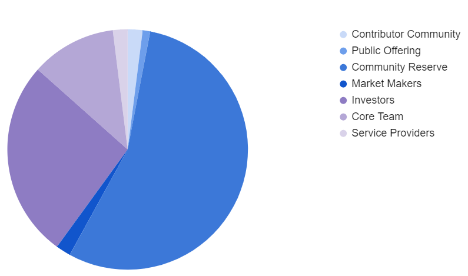
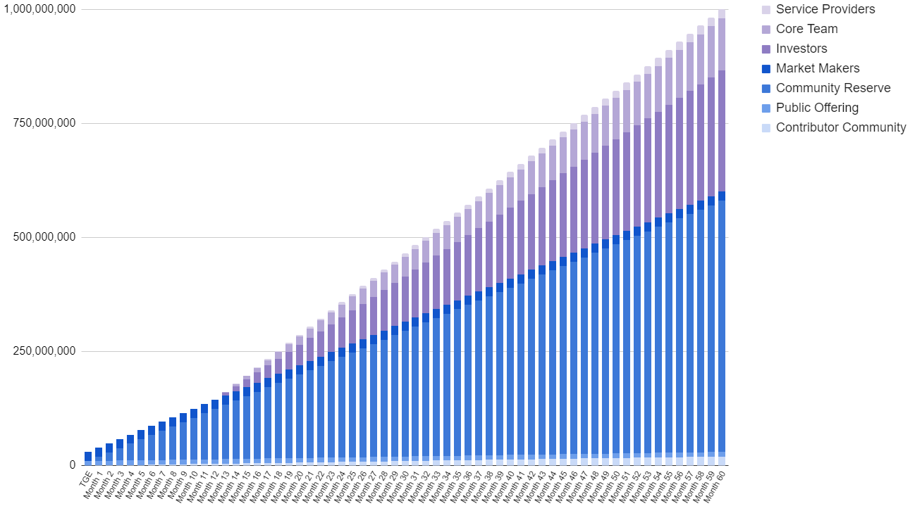

# Token Utility Whitepaper - v1.1

## Introduction
A token economy is non-trivial and continues to be an area of much research and debate in the Ethereum community. This proposal document is just that, a proposal which is intended to deliver a viable starting point for an Obscuro token economy. The economic model is expected to evolve over the lifetime of Obscuro via governance proposals.

Obscuro depends upon a network of intercommunicating Obscuro nodes to achieve its decentralisation, scalability and privacy promises. The Obscuro Mainnet node operators incur operating costs for which they need to be remunerated. This is achieved through a rewards and incentives model for the Obscuro token called OBX. Additionally OBX provides the means for the Obscuro community to vote on change proposals to Obscuro and for ongoing development of the Obscuro ecosystem. 
The Obscuro tokenomics have been designed to be circulatory and self-sustaining with no human intervention and no subsidies. Instead decentralised Obscuro smart contracts handle all token movements (transaction fees, rewards and staking).

Although OBX is not deflationary, token holders are incentivised to stake as node operators or as staking delegates by means of a reward. This will lock up OBX in staking pools and reduce the number of OBX in circulation. 

This tokenomics whitepaper describes the long term intentions for OBX’s utility. In some cases a shorter term approach is used to bootstrap the Obscuro network. Where required, this whitepaper explicitly makes that clear.
In summary, OBX has four utilities:

1.	To provide a reward to incentivise node operators to correctly operate Obscuro nodes and provide a reliable service.
2.	A medium in which users can pay transaction fees and node operators can pay their stake and receive rewards to cover operational costs.
3.	A means to vote on proposals for changes to Obscuro via a governance model.
4.	A means to fund and incentivise the ongoing development of the Obscuro ecosystem via development opportunities, grants and competitions.

## Token Issuance
_This section is non-normative_

OBX is issued by the Obscuro Foundation. The Token Generation Event (TGE) occurs when the Obscuro Mainnet is substantially complete and application builders and Obscuro participants can meaningfully interact with it. The Obscuro Foundation DAO controls the ongoing tokenomics for Obscuro Mainnet according to the DAO’s constitution.

The initial token supply is 1,000,000,000 OBX. There is no minting or burning in the Obscuro protocol design. At a future date the Obscuro DAO will have the option of voting to issue more tokens if required.

The allocations aim to reward ongoing participation in Obscuro and minimise short-termism. The largest allocations with unlocking from the get-go are for community members, third-party integrators and application developers building on top of Obscuro so they can grow and succeed alongside Obscuro.

An airdrop has been intentionally omitted from the allocation because typically they do not benefit projects in the medium to long term. However where a responsible airdrop program can be used to drive adoption of Obscuro this decision will be revisted.

| RECIPIENT             | TOKEN AMOUNT   | ALLOCATION % |
|-----------------------|----------------|--------------|
| Contributor Community | 20,000,000     | 2.00         |
| Public Offering       | 10,000,000     | 1.00         |
| Community Reserve     | 550,000,000    | 55.00        |
| Market Makers         | 20,000,000     | 2.00         |
| Investors*            | 265,700,000    | 26.57        |
| Core Team             | 114,500,000    | 11.45        |
| Service Providers     | 19,800,000     | 1.98         |

   *Pre-seed investor has rights to 23% of token allocation at each token issuance.

    

### Token Staking and Delegated Staking
Nodes must stake OBX when they initially join Obscuro Mainnet as a means for the node operator to demonstrate their intention to maintain privacy, ledger integrity and not attempt to disrupt the safety of the network. The stake is intentionally set at a high value so the loss of stake is material to the operator. Locked tokens can be staked.

If a node finds a discrepancy with the rollup published on the Layer 1 network (e.g. transactions missing, transactions in the wrong order), it can post a challenge including the offending rollup to the Layer 1 network. The management contract will inspect this challenge. If successful, the Aggregator's stake will be slashed, with their entire stake split between the Obscuro Foundation DAO and the challenging node as a reward. This reward is greater than the cost of posting the challenge to incentivise prompt discovery of issues, but less than the total stake to reduce the incentive to mount an attack to win the stake.

The number of tokens required to stake will be reviewed and set by the Obscuro Foundation DAO as the Obscuro Mainnet total value locked (TVL) increases. Increasing the minimum stake as TVL increases continues to economically disincentivise would-be malicious actors from disrupting the network as the theoretical gain from a malicious event becomes more attractive. Once the bootstrapping phase is complete, the size of a node’s stake influences the probability of that node winning the lottery for the rollup submission round.

Delegated staking is also available to allow others without access to large amounts of OBX to participate in Obscuro Mainnet. Delegates are in a position to take a proportion of the reward issued to a node. Delegates are free to choose which node they contribute a stake for, this being an incentive for node operators to provide healthy nodes with good uptime, performance and reliability guarantees. This contributes to the good health of the overall Obscuro network. The Obscuro Foundation DAO monitors the Obscuro network checking for clustering of stakes and a skew towards centralisation from decentralisation in which case additional measures could be proposed to maintain an appropriate degree of decentralisation.

The diagram below summarises the different types of staking and the distribution of delegated stakes.

    

1. Nodes 1 and 2 have the minimum stake value provided by the node operator and they are participants on the Obscuro network. Node 3 does not have the minimum stake therefore it is not a member of the Obscuro network.
2. A delegated stake is provided for node 1 and node 2. Node 2 has the larger delegated stake which has influenced the probability of node 2 winning the rollup lottery.
3. Node 2 has won the rollup lottery. The reward is taken from the pool of transaction fees and shared proportionally amongst the node operator and delegates for Node 2 in line with the proportion of their staked value.

There is an occasion where tokens are slashed although this is expected to be very rare. Specifically, operators who use a hacked enclave on their node in an attempt to break the ledger’s integrity will be discovered by the protocol. Their punishment is to have their stake slashed and returned to the Community Reserve.

### Rewards and Fees
Rewards in Obscuro are an additional incentive to the stake so node operators maintain reliable and accurate nodes thereby contribute to the health of the Obscuro network. During the bootstrapping phase rewards will be limited to the nodes which will be verifying the accuracy of the signed list of transaction hashes generated. After the bootstrapping phase the rewards will be extended to include the nodes producing rollups and publishing to the Layer 1.

Rewards are paid out from a pool of OBX maintained by transaction fees paid in OBX. Because Obscuro does not link fees and rewards directly, the intention is to find a stable equilibrium between the amounts paid into the pool by end users for their transactions and the amounts paid out to nodes for their service. This equilibrium is established when the transaction fees can pay for the Layer 1 gas costs to achieve an optimal rollup submission interval. In periods when the number of transactions is high the pool will grow and the surplus will be used in periods when the number of transactions is lower in order to maintain the rollup submission interval thus providing a predictable user experience. 

## Token Allocation
_This section is non-normative_

### Public Offering and Contributor Community
The Public OFfering and Contributor Community are important for Obscuro to gain early traction in the wider community, achieve organic growth and for early contributors to be recognised for their efforts. It is gratifying and empowering for community members to be rewarded for being active contributors to a project as opposed to receiving the same treatment as people arriving with potentially no genuine enthusiasm for the project. It is also in the interest of the project to identify the value-adding community members and incentivise them to remain active and continue adding value to Obscuro over the long term.

The Contributor Community will be 2% of the total token allocation pool. Contributor Community tokens will be distributed to contributors from the Obscuro community after the launch of Obscuro Mainnet at no cost to the contributor. Contributions are defined, captured, tracked and scored using a decentralised task management tool called Dework. The Dework bounty score indicates how much of the Contributor Community pool a contributor is entitled to. Each contributor's token allocation will be a percentage of their total contributions against the entire community contribution up to the day of Obscuro Mainnet launch.

The Public Offering event and Contributor Community distribution will be conducted through a reputable third-party private offering manager so the necessary regulatory checks are completed with confidence. 

### Community Reserve
The Community Reserve exists to run and enhance the Obscuro platform and develop and evolve the Obscuro ecosystem over time.  The Obscuro Foundation DAO has oversight of how the Community Reserve is put to use. Examples include engagement with engineering talent, or protocol developers, to further develop the Obscuro platform using tokens as a form of incentive, settling of legal fees and covering other operational costs, security tests and bug bounty programs, incentivising members of the community to make meaningful contributions to Obscuro via incentive programs, grants, hackathons and competitions.

### Investors and Core Team
Providing investors and the Core Team with the opportunity to participate in the Obscuro network is an important part of their contribution to the wider Obscuro ecosystem. Token allocations to these groups encourage continued engagement, interest and contributions. Additionally, application builder engagement in Obscuro is a top priority and nurturing deep engagements with partners who can contribute to Obscuro in a very meaningful way is vital. By encouraging investors to remain actively engaged will help open doors to high quality applications within their portfolio of companies and encourage their migration to Obscuro.

### Market Makers
The Market Maker allocation provides market makers with access to tokens they require to provide liquidity for OBX exchange thereby giving end users the opportunity to acquire OBX to use the Obscuro network.

### Service Providers
Over the course of Obscuro’s lifetime there have been and will be specific expertise, talent and guidance required to make Obscuro a useful and successful platform. Companies that provide this service are allocated tokens to gain the opportunity to use the Obscuro platform.

## Token Unlocking
_This section is non-normative_

Token unlocking periods are a mixture of time-based and milestone-based outcomes. The unlocking periods have been designed to strike a balance between allowing utility in Obscuro Mainnet from the get-go and encouraging continued high-quality development and commitment to the Obscuro ecosystem over a number of years.

Tokens distributed to the Contributor Community unlock over the course of 60 months from TGE to encourage continued engagement with Obscuro and discourage early dumping.

Tokens distributed to the Public Offering fully unlock at TGE to allow participation in the Obscuro Mainnet as early as possible without applying downward pressure and making it difficult for others to make use of Obscuro. Specifically, tokens can be used by application users to pay transaction fees, for node operators to stake and for members of the community to participate in delegated staking.

Tokens distributed to the Community Reserve are unlocked on a schedule designed to provide early access to the tokens required to execute on their plans, for example, run hackathons to raise awareness of Obscuro.

Tokens distributed to Investors and the Core Team are initially locked up followed by multi-year unlocks to keep team and investor sentiment high, encourage long term focus in their investment and clearly demonstrate their commitment to the success of Obscuro.

### Token Unlocking Schedule
_This section is normative_

| RECIPIENT             | UNLOCK AFTER    | UNLOCKED PERIOD |
|-----------------------|-----------------|-----------------|
| Contributor Community | 0 months        | 60 months       |
| Public Offering       | 0 months        | 0 months        |
| Community Reserve     | 0 months        | 60 months       |
| Market Makers         | 0 months        | 0 months        |
| Investors             | 12 months       | 48 months       |
| Core Team             | 12 months       | 48 months       |
| Service Providers     | 12 months       | 48 months       |

The chart below shows the token unlocking schedule in graphical form:

    

## Token Value
_This section is non-normative_

Value can be thought of in many different ways and the price of OBX fulfils several requirements. First, Obscuro node operators are remunerated for their operational costs.
    
Second, Obscuro’s decentralisation depends, in part, on the ability to make it economically unviable to control the majority of nodes in the Obscuro network. This is achieved through a staking model where OBX is used.  Delegated staking provides the opportunity for members of the Obscuro community with limited capital to engage with Obscuro.
    
Third, the value early contributors bring to Obscuro to help build the momentum within the community and provide feedback on the project needs to be recognised.

## Appendix A - Contributors
Thanks to the following contributors to this document:

Polo,
Spiritanto,
Slozzzza,
Pizzzyy,
Shill_Pill,
Enforcer AI,
Yarco,
Alex B,
Alex Ye.
