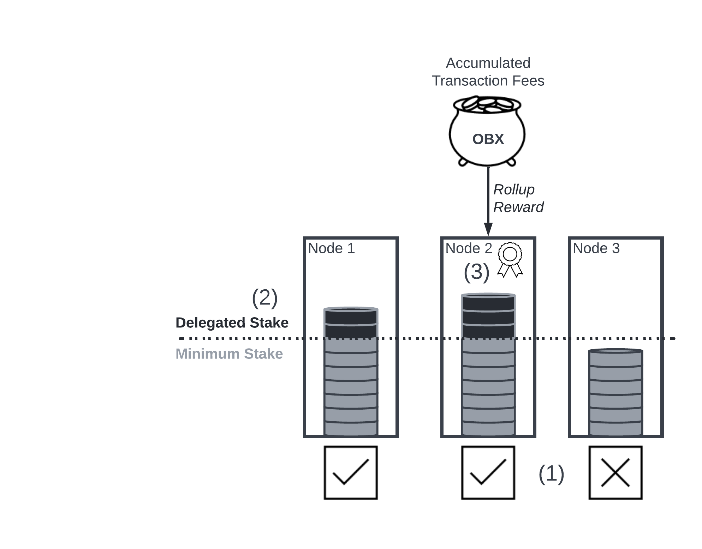
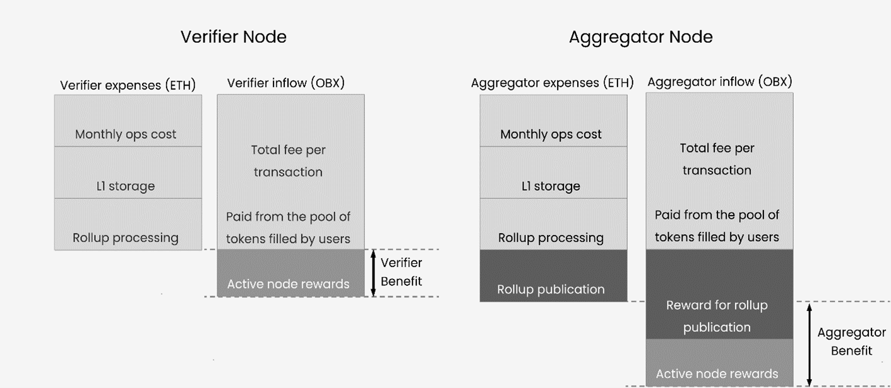
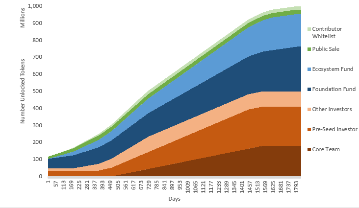

# Token Utility Whitepaper - DRAFT

## Introduction
A token economy is non-trivial and continues to be an area of much research and debate in the Ethereum community. This proposal document is just that, a proposal which is intended to deliver a viable starting point for an Obscuro token economy. The economic model is expected to evolve over the lifetime of Obscuro via governance proposals.
Obscuro depends upon a network of intercommunicating Obscuro nodes to achieve its decentralisation, scalability and privacy promises. The Obscuro Mainnet node operators incur operating costs for which they need to be remunerated. This is achieved through a rewards and incentives model for the Obscuro token called OBX. Additionally OBX provides the means for the Obscuro community to vote on change proposals to Obscuro and for ongoing development of the Obscuro ecosystem. Over 50% of OBX is distributed directly to the community so they control the evolution of Obscuro.
The Obscuro tokenomics have been designed to be circulatory and self-sustaining with no human intervention and no subsidies. Instead decentralised Obscuro smart contracts handle all token movements (transaction fees, rewards and staking).
Although OBX is not deflationary, token holders are incentivised to stake as Aggregator node operators or as staking delegates by means of a reward. This will lock up OBX in staking pools and reduce the number of OBX in circulation. 

In summary, OBX has four utilities:
1.	To provide a reward to incentivise node operators  to correctly operate Obscuro nodes and provide a reliable service.
1.	A medium in which users can pay fees and node operators can pay their stake and receive rewards to cover operational costs.
1.	A means to vote on proposals for changes to Obscuro via a governance model.
1.	A means to fund and incentivise the ongoing development of the Obscuro ecosystem via development opportunities, grants and competitions.

## Token Issuance and Rewards
_This section is non-normative_

OBX is issued by the Obscuro Foundation. The Token Generation Event (TGE) occurs when the Obscuro Testnet is substantially complete and application builders and Obscuro participants can meaningfully interact with the Testnet. The Obscuro DAO controls the ongoing tokenomics for Obscuro Mainnet according to the DAO’s constitution.
The initial token supply is 1,000,000,000 OBX. There is no minting or burning in the Obscuro protocol design. At a future date the Obscuro DAO will have the option of voting to issue more tokens if required.
The allocations aim to reward ongoing participation in Obscuro and minimise short-termism. The largest allocations with unlocking from the get-go are for community members, third-party integrators and application developers building on top of Obscuro so they can grow and succeed alongside Obscuro.
An airdrop has been intentionally omitted from the allocation because typically they do not benefit projects in the medium to long term.

There is an occasion where tokens are slashed although this is expected to be very rare. Specifically, Aggregator operators that use a hacked enclave on their node in an attempt to break the ledger’s integrity will be discovered by the protocol. Their punishment is to have their stake slashed and returned to the Ecosystem Fund.

| RECIPIENT             | TOKEN AMOUNT   | ALLOCATION |
|-----------------------|----------------|------------|
| Contributor Whitelist | 20,000,000     | 2%         |
| Public Sale           | 26,000,000     | 2.6%       |
| Foundation Fund       | 238,000,000    | 23.8%      |
| Ecosystem Fund        | 192,000,000    | 19.2%      |
| Pre-Seed Investor*    | 230,000,000    | 23%        |
| Seed Investors        | 90,000,000     | 9%         |
| Core Team             | 180,000,000    | 18%        |
| Service Providers     | 24,000,000     | 2.4%       |

* Pre-seed investor has rights to 23% of token allocation at each token issuance.

### Token Staking and Delegated Staking
Aggregator nodes must stake OBX when they initially join Obscuro Mainnet as a means for the node operator to demonstrate their intention to maintain privacy, ledger integrity and not attempt to disrupt the safety of the network. The stake is intentionally set at a high value so the loss of stake is material to the operator. 
The number of tokens required to stake will be reviewed and set by the Obscuro DAO as the Obscuro Mainnet total value locked (TVL) increases. Increasing the minimum stake as TVL increases continues to economically disincentivise would-be malicious actors from disrupting the network as the theoretical gain from a malicious event becomes more attractive. Locked tokens can be staked. The size of an Aggregator node’s stake influences the probability of that node winning the lottery for the rollup submission round. 

<!-- with a centralised model with only verifiers being decentralised, there is no reason for a validator to be hacked because the only outcome that can be achieved would be to instigate a false challenge and triggering human intervention. Therefore its debatable whether a stake is required (in the original model verifiers do not need to put down a stake, only the aggregators do. This makes delegated staking a non-starter.
There might, however, be an argument for using staking so validators prove their willingness to respond to user queries in an accurate and timely manner. Underperforming validators would have their stake slashed. This could help offset the 'race to the bottom' where node operators run their validators as cheaply as possible to get the most upside from the node hosting reward -->

Delegated staking could also be made available to allow others without access to large amounts of OBX to participate in Obscuro Mainnet. Delegated staking could be available across Aggregator nodes but not available for Verifier nodes because there is not a staking requirement for Verifier nodes to join the Obscuro network. Delegates could be in a position to take a proportion of the rollup reward issued to the Aggregator node that wins the rollup submission lottery. Delegates might be free to choose which Aggregator node they contribute a stake for, this being an incentive for Aggregator node operators to provide healthy nodes with good uptime, performance and reliability guarantees. This would contribute to the good health of the overall Obscuro network. The Obscuro DAO could monitor the Obscuro network checking for clustering of stakes and a skew towards centralisation from decentralisation in which case additional measures could be proposed to maintain an appropriate degree of decentralisation. Ultimately it is a decision of the Obscuro community how delegated staking does, or does not, get implemented.
The diagram below summarises the different types of staking and the potential distribution of delegated stakes.

    

1.	Aggregator nodes 1 and 2 have the minimum stake value provided by the node operator and they are participants on the Obscuro network. Node 3 does not have the minimum stake therefore it is not a member of the Obscuro network.
1.	A delegated stake is provided for node 1 and node 2. Node 2 has the larger delegated stake which has influenced the probability of node 2 winning the rollup lottery.
1.	Node 2 has won the rollup lottery. The rollup reward is taken from the pool of transaction fees and shared proportionally amongst the node operator and delegates for Node 2 in line with the proportion of their staked value.

### Rewards and Fees
Rollup rewards and active node rewards are paid out from a pool of OBX maintained by transactions fees paid in OBX. Because Obscuro does not link fees and rewards directly, the intention is to find a stable equilibrium between the amounts paid into the pool by end user transactions and the amounts paid out to nodes for their service. This equilibrium is established when the transaction fees can pay for the Layer 1 gas costs to achieve an optimal rollup submission interval.. In periods when the number of transactions is high the pool will grow and the surplus will be used in periods when the number of transactions is lower in order to maintain the rollup submission interval thus providing a predictable user experience. 
The stable relationship between expenses and rewards for the Verifier and Aggregator can be summarised as follows:

    

The Aggregator benefit can be expressed as:

_Aggregator benefit received = (reward for rollup publication + active node reward - rollup publication cost) × percentage proportion of total stake on Mainnet_

## Token Allocation
_This section is non-normative_

### Public Sale and Contributor Whitelist
The Public Sale and Contributor Whitelist are important for Obscuro to gain early traction in the wider community, achieve organic growth and for early contributors to be recognised for their efforts. It is gratifying and empowering for community members to be rewarded for being active contributors to a project as opposed to receiving the same treatment as people arriving with potentially no genuine enthusiasm for the project. It is also in the interest of the project to identify the value-adding community members and incentivise them to remain active and continue adding value to Obscuro over the long term. 
The Contributor Whitelist will be 2% of the total token allocation pool. Contributor Whitelist tokens will be distributed to contributors from the Obscuro community after the launch of Obscuro Mainnet at no cost to the contributor. Contributions are defined, captured, tracked and scored using a decentralised task management tool called Dework. The Dework bounty score indicates how much of the Contributor Whitelist pool a contributor is entitled to. Each contributor's token allocation will be a percentage of their total contributions against the entire community contribution up to the day of Obscuro Mainnet launch.
The Public Sale event and Contributor Whitelist distribution will be conducted through a reputable third-party private sale manager so regulatory checks are completed with confidence. 

### Foundation Fund
The Foundation token fund exists to run and enhance the Obscuro platform over time. First, the Foundation is empowered to engage with engineering talent, or protocol developers, to further develop the Obscuro platform using tokens as a form of incentive. Second, this fund provides Market Makers with access to tokens they require to provide liquidity for OBX exchange. Third, legal fees and other operational costs are settled from this fund. Fourth, advisor services to the Obscuro project are paid using tokens. The table below details how the Foundation Fund is potentially used. Do bear in mind the Foundation governance process will need to approve these proposed allocations:

| PURPOSE                          | % ALLOCATION | NUMBER TOKENS     | WHEN?                             |
|----------------------------------|--------------|-------------------|-----------------------------------|
| Protocol Developers              | 71           | 186,020,000       | over 5 years with 1 year delay    |
| Market Makers                    | 20           | 52,400,000        | over 0 years from TGE             |
| Legal fees and operational costs | 7            | 18,340,000        | over 5 years from TGE             |
| Advisors                         | 2            | 5,240,000         | over 0.08 years with 1 year delay |

### Ecosystem Fund
The Ecosystem token fund exists to develop and evolve the Obscuro ecosystem over time. First, the security and integrity of Obscuro is paramount to it's trustworthiness and high degree of confidence in the technology. Code audits, security tests and bug bounty programs are covered by the Ecosystem Fund. Second, incentivising members of the community to make meaningful contributions to Obscuro in different ways over the long term is done via incentive programs and competitions. Third, execution of a marketing strategy to increase awareness in Obscuro. Fourth, grants and incentives are offered to application builders to deploy their applications to Obscuro Mainnet. Tokens provided via these grants and incentive programs will be subject to specific unlocking periods. The table below details how the Ecosystem Fund is potentially used:

| PURPOSE                             | % ALLOCATION | NUMBER TOKENS     | WHEN?                                      |
|-------------------------------------|--------------|-------------------|--------------------------------------------|
| Code audits and security tests      | 20           | 38,400,000        | over 4 years from TGE                      |
| Bug Bounty                          | 20           | 38,400,000        | over 4 years from TGE                      |
| Incentive programs and competitions | 20           | 38,340,000        | over 4 years from Mainnet launch           |
| Marketing                           | 17           | 32,640,000        | over 4 years from Mainnet launch - 1 month |
| Application builders                | 3            | 5,760,000         | over 0.5 years from TGE                    |
| Contingency                         | 20           | 38,400,000        |                                            |

### Investors and Core Team
Providing investors and the Core Team with the opportunity to participate in the Obscuro network is an important part of their contribution to the wider Obscuro ecosystem. Token allocations to these groups encourage continued engagement, interest and contributions. Additionally, application builder engagement in Obscuro is a top priority and nurturing deep engagements with partners who can contribute to Obscuro in a very meaningful way is vital. By encouraging investors to remain actively engaged will help open doors to high quality applications within their portfolio of companies and encourage their migration to Obscuro.

### Service Providers
Third party service providers who contribute to and participate in the Obscuro project are allocated a number of tokens in return for services rendered.

## Token Unlocking
_This section is non-normative_

Token unlocking periods are a mixture of time-based and milestone-based outcomes. The unlocking periods have been designed to strike a balance between allowing utility in Obscuro Mainnet from the get-go and encouraging continued high-quality development and commitment to the Obscuro ecosystem over a number of years.
Tokens distributed to the Contributor Whitelist unlock over the course of 600 days to encourage continued engagement with Obscuro and discourage early dumping.
Tokens distributed to the Public Sale unlock relatively early to allow participation in the Obscuro Mainnet as early as possible without applying downward pressure. Specifically, tokens can be used by application users to pay transaction fees, for node operators to stake and for members of the community to participate in delegated staking.
Tokens distributed to the Foundation Fund and Ecosystem Fund are unlocked on a schedule designed to provide early access to the tokens required to execute on their plans, for example, make tokens available to market makers.
Tokens distributed to Investors and the Core Team are initially locked followed by a multi-year unlock to keep team and investor sentiment high, encourage long term focus in their investment and clearly demonstrate their commitment to the success of Obscuro.

### Token Unlocking Schedule
_This section is normative_

| TOKEN DISTRIBUTION       | TOKEN AMOUNT   | UNLOCKING BASIS | UNLOCKING SCHEDULE                                                                |
|--------------------------|----------------|-----------------|-----------------------------------------------------------------------------------|
| Contributor Whitelist    | 20,000,000     | Milestone       | Daily linear unlock for 600 days from Obscuro Mainnet launch                      |
| Public Sale              | 26,000,000     | Time            | 50% at TGE then daily linear unlock for 1 year                                    |
| Foundation Fund          | 238,000,000    | Time            | 21% at TGE then daily linear unlock for 5 years                                   |
| Ecosystem Fund           | 192,000,000    | Time            | Daily linear unlock for 4.5 years                                                 |
| Pre-Seed Investor        | 230,000,000    | Time            | 15% unlock at TGE then 12 month cliff followed by daily linear unlock for 3 years |
| Seed Investors           | 90,000,000     | Time            | 15% unlock at TGE then 6 month cliff followed by daily linear unlock for 18 months|
| Core Team                | 180,000,000    | Milestone       | 12 month cliff then daily linear unlock for 3 years from Obscuro Mainnet launch   |
| Service Providers        | 24,000,000     | Time            | 12 month cliff then daily linear unlock for 1 year                                |

    

## Token Pricing
_This section is non-normative_

### Initial Token Price
Value can be thought of in many different ways and the price of OBX fulfils several requirements. First, Obscuro node operators are remunerated for their operational costs.
Second, Obscuro’s decentralisation depends, in part, on the ability to make it economically unviable to control the majority of nodes in the Obscuro network. This is achieved through a staking model where OBX is used.  Delegated staking provides the opportunity for members of the Obscuro community with limited capital to engage with Obscuro.
<!-- this only makes sense when the aggregators are decentralised, i.e. after phase 1 -->
Third, the value early contributors bring to Obscuro to help build the momentum within the community and provide feedback on the project needs to be recognised.
Contributor Whitelist tokens will be excluded from the Public Sale. An unlocking schedule helps mitigate downward pressure on the token price by Contributor Whitelist members trying to gain an economic advantage.

### Liquidity Pools
With OBX being a native token to Obscuro Mainnet there is a requirement to exchange OBX for the Layer 1 native token in order to pay for the rollups submitted to the Layer 1. This creates a need for an OBX/L1 token trading pair. It is desirable for the OBX/L1 token exchange rate to be as stable as possible so rollup costs in terms of OBX remain stable which in turn leads to a more accurate and reliable determination of transaction fees. This is a better experience for network participants.
The more liquidity a trading pair has the tighter the gap between offers to exchange OBX for the Layer 1 native token therefore the more stable the exchange rate. Liquidity pools are a means of creating deep liquidity. It also means participants can quickly convert OBX to the Layer 1 token if they so wish. OBX liquidity pools are created by Market Makers.

## Appendix A - Alternatives Considered
### Why Not Use ETH?
Obscuro is designed as a Layer 2 solution for Ethereum. When a Rollup from the Obscuro Network is submitted to Ethereum the submitting Obscuro Aggregator node operator is required to pay a computation fee in the form of Ethereum gas. This gas fee must be paid for in ETH, Ethereum’s native token. So why not simply use ETH across the Obscuro ecosystem and remove the need for OBX? There are 3 main reasons why OBX is preferable to ETH.
First, being able to measure the value of Obscuro is achieved by using a native utility token because it has a direct and intimate relationship with the Obscuro ecosystem, technology and network participants. Using ETH would cloud the value of Obscuro to the extent it would be impossible to measure and understand whether or not Obscuro is relevant and valuable to its users. If Obscuro does not deliver the features Web3 demand then its value will subside. If Obscuro provides access to new business opportunities then its value will grow.
Second, the future plans for Obscuro include interoperability with other L1 networks in addition to Ethereum. This means the fees incurred to submit confidential rollups will be incurred in the native token for those other L1s. It is imperative Obscuro continues providing a good user experience for end users regardless of the L1 they choose to use. By simply using OBX to pay fees rather than the native token for each L1 – Obscuro will handle the token exchange in the background – it is a better experience for the end user. They will benefit from excellent portability between L1 networks and yet can remain within the Obscuro ecosystem, and experience full privacy, the entire time.
Third, the Foundation can be more influential in the direction Obscuro takes by making use of Ecosystem Fund tokens for grants, aggregator incentives and competitions. Using ETH would be challenging because the Foundation cannot make decisions on an ETH token pool.
Fourth, OBX is a governance token. There is interest in holding governance tokens because there is a tangible return from being able to vote for proposals: you can vote for proposals which help prioritise your future plans so your plans can reach fruition more quickly and you can achieve your desired outcome. 

### Why No Revenue Model?
A revenue generation model employed by some L2 solutions is to charge a fee on transactions. For example this can be done by applying a fee scalar to the gas fee for submitting a rollup to the L1 thereby generating an income.
In theory Obscuro could use the same model with the operator of the Obscuro network, the Obscuro Foundation, charging a fee each time Obscuro is used. Those fees could be used to pay for the next tranche of development, run competitions and fund incentive schemes, for example. There are 2 main reasons why fees do not fit with Obscuro.
First, and most crucially, how are fees charged in a decentralised environment? There is no central sequencer or aggregator therefore no single “weigh station” to analyse smart contracts and determine the correct fee.
<!-- in a centralised model this argument goes away but should be replaced with the fact the transaction information is encrypted / private therefore to determine the correct fee based on the smart contract activity, e.g. size of token exchange, would be impossible. -->
Second, Obscuro software is open source therefore anyone is able to fork the code and create a competing product. It would be possible to emulate Obscuro and charge a lower fee and undercut the original implementation of Obscuro.

## Appendix B - Contributors
Thanks to the following contributors to this document:

Polo,
Spiritanto,
Slozzzza,
Pizzzyy,
Shill_Pill,
Enforcer AI,
Yarco
